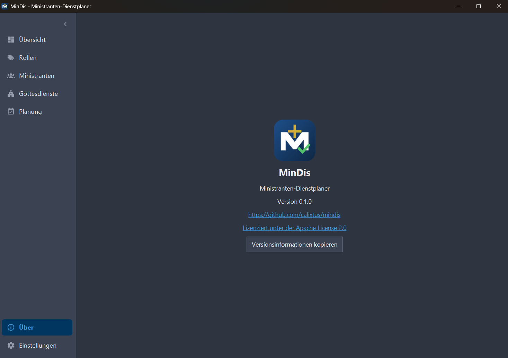

# MinDis - Minister Dispatcher (Ministranten Dienstplaner)

MinDis is an open-source, cross-plattform scheduling tool for altar servers. This tool is designed to help schedule altar servers for church services.

This project is under active development and is not yet ready for production use. A release will be made when the project is ready.
