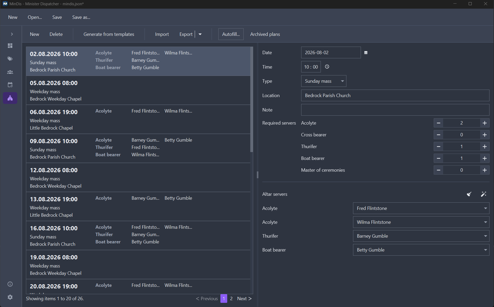

# MinDis - Minister Dispatcher (Ministranten Dienstplaner)

MinDis is an open-source, cross-plattform scheduling tool for altar servers. This tool is designed to help schedule altar servers for church services.

This project is under active development and is not yet ready for production use. A release will be made when the project is ready.

## License

MinDis is licensed under the [Apache License 2.0](LICENSE).

Every library bundled with MinDis is permissively licensed; the build enforces that against
[`config/licenses/allowed-licenses.json`](config/licenses/allowed-licenses.json) and fails on
anything else. The notices for the bundled libraries, the Java runtime and the embedded fonts are
generated from the resolved dependencies at build time and shown in the application under
**About → Third-party licenses**. The policy is [ADR 008](docs/adr/008-third-party-licensing.md).
